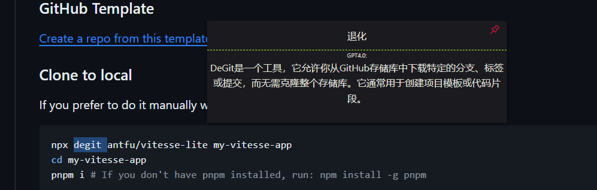

# eletools 一个electorn实现的翻译工具 

## Recommended IDE Setup

- [VSCode](https://code.visualstudio.com/) + [ESLint](https://marketplace.visualstudio.com/items?itemName=dbaeumer.vscode-eslint) + [Prettier](https://marketplace.visualstudio.com/items?itemName=esbenp.prettier-vscode) + [Volar](https://marketplace.visualstudio.com/items?itemName=Vue.volar) + [TypeScript Vue Plugin (Volar)](https://marketplace.visualstudio.com/items?itemName=Vue.vscode-typescript-vue-plugin)

## 1.产品特点

### 快速进行翻译 并且可以使用gpt4.0进行搜索补充等 更加快捷理解内容 减少繁琐操作

### [nutjs ](https://nutjs.dev)代替robotjs实现自动化操作

### [*uiohook*-napi](https://github.com/SnosMe/uiohook-napi)代替iohook 实现事件监听

### 兼容高版本的electron框架

### node - v  = 18.16.0

## 2.具体使用方法

### 1.左键选中内容 

### 2.右键长按0.2s左右

### 3.eletools中红线上面显示翻译deeplx内容 下面显示gpt4.0搜寻到的内容

## 3.使用示例

